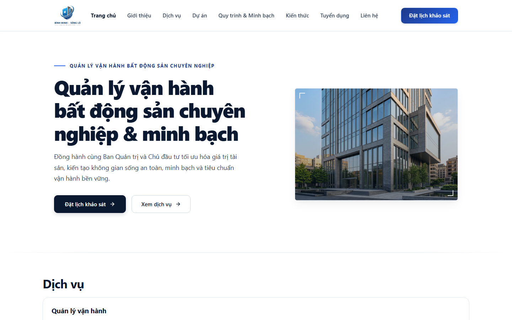
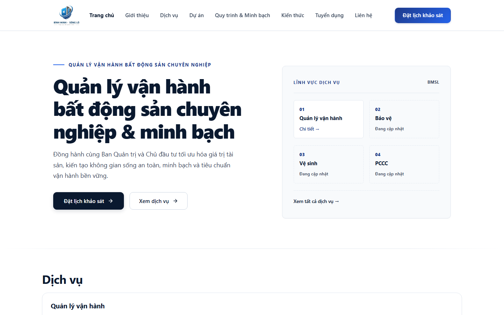
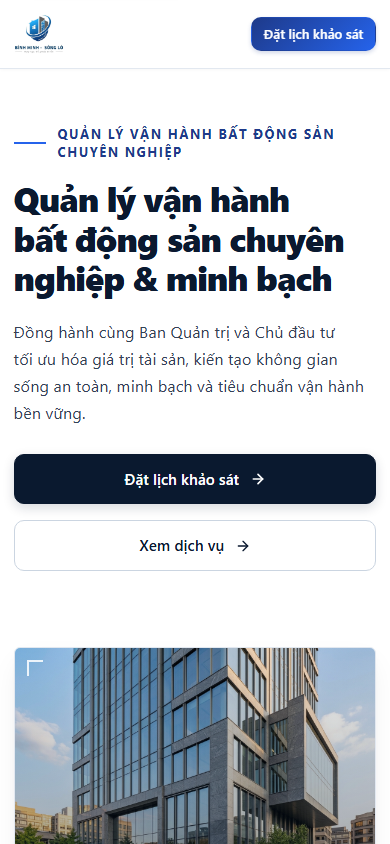
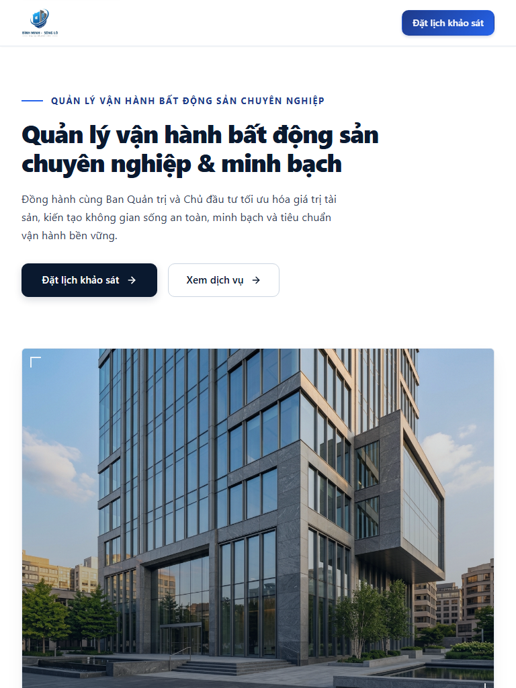

# Visual QA & Art Direction Acceptance Evidence

This directory contains verified screenshot artifacts and accessibility audit proof for **Issue #106** (Design Plan: Premium Architectural Hero Section) and **Issue #102** (CMS Contract: HomePage Hero Model).

All screenshots are generated against exact PR #108 code and verified with Playwright and `@axe-core/playwright`.

---

## 1. Visual Proof Across Breakpoints

### A. Desktop Viewport (1440 × 900)

#### With Approved Architectural Image:

#### Fail-Closed Text-First Fallback (No Media / Unconfirmed Media):

---

### B. Mobile Viewport (390 × 844)

#### With Architectural Image:

#### Fail-Closed Fallback (Text-First):

---

### C. Tablet & Compact Mobile

#### Tablet (768 × 1024):

#### Compact Mobile (320 × 568):

---

## 2. Breakpoint & Overflow Scorecard

| Viewport Target | Width × Height | Visual Layout | Horizontal Overflow | Result |
| :--- | :--- | :--- | :---: | :---: |
| **Desktop High-Res** | 1440 × 900 | 52% content / 48% framing | **0px** |  PASS |
| **Small Desktop / Laptop**| 1024 × 768 | Proportional asymmetric grid| **0px** |  PASS |
| **Tablet Portrait** | 768 × 1024 | Stacked editorial column | **0px** |  PASS |
| **Mobile Standard** | 390 × 844 | Eager touch targets, responsive clamp | **0px** |  PASS |
| **Mobile Compact** | 320 × 568 | Zero clipping, single-column matrix | **0px** |  PASS |

---

## 3. Accessibility & Performance Proof

* **Axe Core WCAG 2.0 / 2.1 AA:** **0 violations** (Verified via `@axe-core/playwright`).
* **Cumulative Layout Shift (CLS):** **0.00** (Explicit image dimensions & aspect-ratio container prevent layout reflow).
* **LCP Optimization:** `fetchPriority="high"`, `decoding="async"`, and native eager load.
* **Safe Service Links:** Fallback matrix binds to live published service records (`getServices()`). If a service has no published detail slug, it renders as a static entry with no dead link, pointing to the canonical `/dich-vu` directory index.
